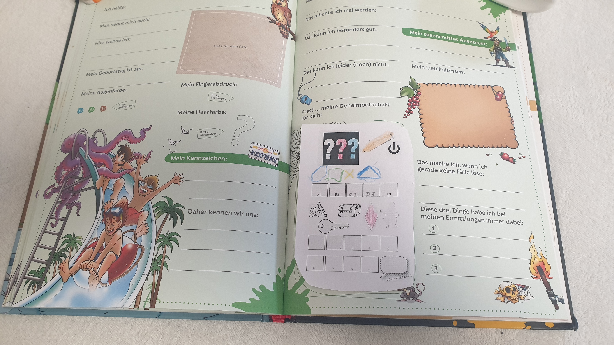

# Raetsel-Einkleber fuer ein Drei-Fragezeichen Freundebuch

Zum erstellen einer personalisierten .gme-Datei ist das [tttool](https://github.com/entropia/tip-toi-reveng)
genutzt.

Idealerweise werden eigene Audiodateien eingebunden. Wenn es eine lange
Nachricht gibt koennen auch die Bilder (Truhe, Krystall, Pirat) ausgetauscht
werden. 

Nach dem Schwarz-Weiss Ausdruck koennen die Fragezeichen mit einem Buntstift
angemalt werden und der Kreis, Viereck, Kreuz und Dreieck aufgemalt werden.

## Loesung des Raetsel

1. Erste Reihe dritte Flaeche ist das Kreuz
2. Zweite Reihe Erst A3 dann E3 eintippen
3. Dritte Reihe die Truhe
4. Vierte Reihe das Feld mit der 3
5. Erst dann gibt die Sprechblase die Botschaft frei. Beim 2ten mal antippen
der Sprechblase gibt es die lange Botschaft

Abweichen des Loesungswegs fuehrt zur Sackgasse und man muss erst durch
Tippen auf die Fragezeichen einen 'Reset' durchfuehren.

Ausserdem gibt es eine Abkuerzung, man kann zu einem beliebigen Zeitpunkt
den Punkt des linken Fragezeichens anklicken und die Botschaft ist direkt
freigegeben.

